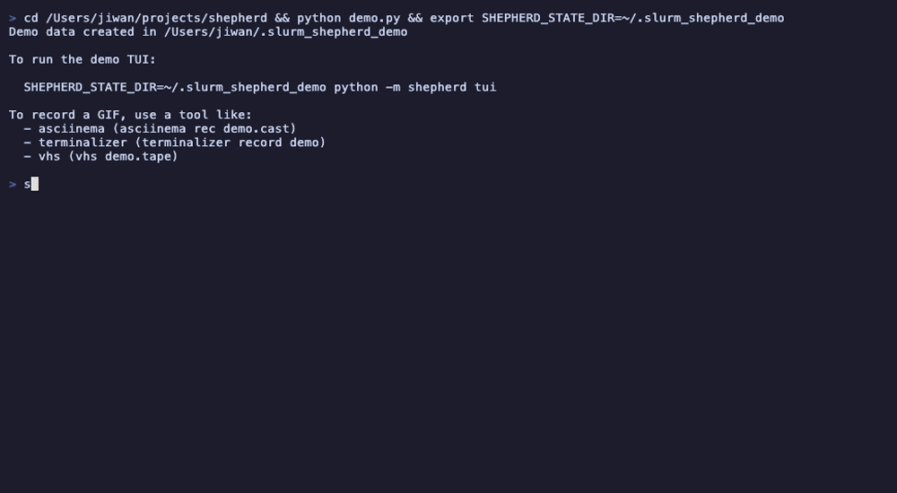

<div align="center">

# 🐑 Shepherd

**A resilient Slurm job orchestrator that keeps your GPU workloads running**

[](https://www.python.org)
[](LICENSE)
[](https://slurm.schedmd.com/)
[]()

[Features](#features) • [Installation](#install) • [Quick Start](#quick-start) • [Documentation](#how-it-works) • [Contributing](#tests)



</div>

---

## The Problem

Running ML training jobs on shared Slurm clusters is painful:

- 🔥 Nodes go down mid-training
- 💥 GPUs throw random CUDA errors
- 🚧 Partitions get congested
- ⏰ Preemption kills your 3-day run at hour 71

**Shepherd watches your jobs and handles failures automatically** — so you can sleep while your models train.

---

## Features

<table>
<tr>
<td width="50%">

### 🔄 Automatic Recovery
- **Heartbeat monitoring** — Detects hung jobs
- **GPU fault detection** — Catches CUDA errors early
- **Node blacklisting** — Avoids problematic nodes
- **Exponential backoff** — Smart retry delays

</td>
<td width="50%">

### 🎯 Smart Scheduling
- **Partition auto-discovery** — Finds matching GPUs
- **Partition failover** — Tries next queue on failure
- **VRAM filtering** — 40GB+, 80GB+, etc.
- **Preference modes** — Best or cheapest first

</td>
</tr>
<tr>
<td width="50%">

### 🖥️ Modern Interface
- **Interactive TUI** — Beautiful terminal UI
- **Node management** — Ban/unban with keyboard
- **GPU smoke tests** — Test CUDA on all nodes
- **Log viewer** — Tail logs in real-time
- **Status icons** — See state at a glance

</td>
<td width="50%">

### 🌐 Remote Clusters
- **SSH execution** — Run on remote clusters
- **Auto-sync** — Code syncs when changed
- **Zero setup** — Uses your SSH config
- **No admin required** — Standard Slurm CLI only

</td>
</tr>
</table>

---

## Install

```bash
git clone <repo> && cd shepherd
uv tool install .
```

Or run directly from source:

```bash
python -m shepherd --help
```

## Quick Start

Create a script (`train.sh`):

```bash
#!/bin/bash
#SHEPHERD --gpus 4 --min-vram 40

python train.py
```

All `#SHEPHERD` directives (CLI flags override these):

| Directive | Description |
|-----------|-------------|
| `--gpus N` | Minimum GPUs per node |
| `--min-vram N` | Minimum VRAM per GPU (GB) |
| `--max-vram N` | Maximum VRAM per GPU (GB) |
| `--prefer min\|max` | Partition ordering |
| `--mode run_once\|indefinite` | Run mode |
| `--partitions a,b,c` | Manual partition list |
| `--max-retries N` | Max restart attempts |
| `--keep-alive N` | Duration in seconds (indefinite mode) |
| `--heartbeat-interval N` | Heartbeat frequency (seconds) |
| `--heartbeat-grace N` | Grace period before restart (seconds) |
| `--backoff-base N` | Base backoff delay (seconds) |
| `--backoff-max N` | Max backoff delay (seconds) |
| `--blacklist-ttl N` | Node blacklist duration (seconds) |

Run with shepherd:

```bash
shepherd train.sh
shepherd
```

Shepherd parses `#SHEPHERD` directives, auto-discovers matching GPU partitions, and orders them best-first. Use `--prefer min` for cheapest-first. Jobs auto-restart on preemption with bad node blacklisting.

## TUI

A modern terminal interface for monitoring and controlling jobs:

```
┌──────────────────────────────────── SHEPHERD ─────────────────────────────────────┐
│ 3 runs · 2 running · 1 pending                                                    │
├───────────────────────────────────────────────────────────────────────────────────┤
│  ▸ llama-finetune       ● running    job=284719    2h ago                         │
│    gpt-evaluation       ● running    job=284720    45m ago                        │
│    mistral-pretrain     ◐ pending    job=284721    5m ago                         │
├───────────────────────────────────────────────────────────────────────────────────┤
│ ────────────────── SLURM ──────────────────  ────────────────── RUN ────────────  │
│  Job ID      284719                           Heartbeat   5s ago                  │
│  State       RUNNING                          Restarts    2                       │
│  Partition   gpu-a100                         Mode        indefinite              │
│  Node        gpu-node-042                                                         │
├───────────────────────────────────────────────────────────────────────────────────┤
│  ↑↓ navigate  Tab panel  r restart  s stop  p pause  q quit                      │
└───────────────────────────────────────────────────────────────────────────────────┘
```

### Key Bindings

| Key | Action |
|-----|--------|
| `j/k` or arrows | Navigate runs |
| `Tab` | Cycle right panel: INFO → SCRIPT → LOGS |
| `[/]` or `-/=` | Scroll right panel |
| `PgUp/PgDn` | Scroll by page |
| `1/2` | Switch stdout/stderr (in LOGS tab) |
| `r` | Restart selected run |
| `s` | Stop selected run |
| `p/u` | Pause/unpause |
| `n` | Create new run |
| `b` | Manage blacklist |
| `/` | Filter runs |
| `o` | Cycle sort order |
| `Enter` | Fullscreen detail view |
| `?` | Help |
| `q` | Quit |

### Nodes TUI

The nodes view (`shepherd nodes`) provides GPU smoke testing:

| Key | Action |
|-----|--------|
| `↑/↓` | Navigate nodes |
| `Enter` | Ban/unban node |
| `s` | Run CUDA smoke tests on all nodes |
| `r` | Refresh node list |
| `q` | Quit |

Smoke test results:
| Icon | Status |
|------|--------|
| `✓` | CUDA working |
| `✗` | CUDA failed |
| `○` | No CUDA libs installed |
| `●` | Node busy (no free GPUs) |
| `⊘` | QOS/partition error |
| `⏱` | Timeout |

### GPU Availability

The `shepherd gpus` command shows max assignable GPUs per partition:

```
Partition                GPU            VRAM    Max   Avail  Nodes      Total
─────────────────────────────────────────────────────────────────────────────────────
suma_a100                a100           80GB   8    ○ 8    0/3       24/24
gigabyte_A6000           a6000          48GB   8    ○ 8    3/6       48/48
suma_rtx4090             rtx4090        24GB   6    ◐ 4    2/11      66/66
```

| Column | Description |
|--------|-------------|
| Max | Maximum GPUs on a single node |
| Avail | Max available on any single node now |
| Nodes | Nodes with free GPUs / total nodes |
| Total | Cluster-wide available / total GPUs |

Availability icons: `○` (green, full) `◐` (yellow, partial) `●` (red, none)

### Status Icons

| Icon | Status |
|------|--------|
| `●` | Healthy running |
| `◐` | Running (degraded/paused) |
| `○` | Pending |
| `↻` | Restarting |
| `✖` | Unresponsive |
| `✓` | Completed |
| `■` | Stopped |

### Log Viewing

The LOGS tab automatically finds Slurm output files:

1. Explicit path from `meta.json` (`stdout_path` / `stderr_path`)
2. Parsed from sbatch script (`#SBATCH --output=...`)
3. Default Slurm pattern `slurm-<job_id>.out`
4. Fallback to shepherd run directory

## Remote Execution

Run shepherd on a remote Slurm cluster via SSH:

```bash
# Sync code to remote (one-time)
shepherd --remote mycluster sync

# Run TUI on remote (with TTY)
shepherd --remote mycluster tui

# Other commands
shepherd --remote mycluster list
shepherd --remote mycluster status --run-id my-job
shepherd --remote mycluster control restart --run-id my-job
```

The daemon auto-starts on the remote host. Options:

| Flag | Description |
|------|-------------|
| `--remote HOST` | SSH host (from ~/.ssh/config) |
| `--remote-python CMD` | Custom Python command |
| `--remote-dir DIR` | Sync destination (default: ~/.local/lib/shepherd) |

## Partition Fallback

Automatically failover to backup partitions when submission fails:

```json
{
  "run_id": "my-job",
  "run_mode": "run_once",
  "sbatch_script": "~/jobs/train.sh",
  "partition_fallback": {
    "partitions": ["gpu-high", "gpu-low", "cpu"],
    "retry_per_partition": 2,
    "reset_to_preferred_sec": 3600
  }
}
```

| Field | Default | Description |
|-------|---------|-------------|
| `partitions` | required | Ordered list (first = preferred) |
| `retry_per_partition` | 2 | Failures before next partition |
| `reset_to_preferred_sec` | 3600 | Interval to retry preferred |

## How It Works

Shepherd wraps your script with monitoring and manages the full lifecycle:

```
                                    ┌─────────────────────────────┐
                                    │      Your Training Job      │
                                    │    (python train.py, etc)   │
                                    └──────────────┬──────────────┘
                                                   │
                                    ┌──────────────▼──────────────┐
                                    │     Shepherd Wrapper        │
                                    │  • GPU visibility check     │
                                    │  • CUDA smoke test          │
                                    │  • Heartbeat thread         │
                                    │  • Failure reporting        │
                                    └──────────────┬──────────────┘
                                                   │
┌─────────────────────────────────────────────────▼─────────────────────────────────────────────────┐
│                                      Shepherd Daemon                                              │
│  ┌─────────────┐  ┌─────────────┐  ┌─────────────┐  ┌─────────────┐  ┌─────────────┐            │
│  │   Monitor   │  │  Heartbeat  │  │   Auto-     │  │  Partition  │  │    Node     │            │
│  │  Job State  │  │ Validation  │  │  Restart    │  │  Failover   │  │ Blacklist   │            │
│  └─────────────┘  └─────────────┘  └─────────────┘  └─────────────┘  └─────────────┘            │
└─────────────────────────────────────────────────┬─────────────────────────────────────────────────┘
                                                   │
                                    ┌──────────────▼──────────────┐
                                    │           Slurm             │
                                    │   sbatch / squeue / scancel │
                                    └─────────────────────────────┘
```

**The wrapper provides:**
- **Heartbeat** — Detect stuck jobs before wasting hours
- **GPU probes** — Fail fast on bad nodes (CUDA test, visibility check)
- **Exit codes** — Semantic codes trigger appropriate recovery actions

## CLI Reference

```bash
# Create a run (auto-discovers GPU partitions)
shepherd train.sh                                      # uses #SHEPHERD directives from script
shepherd train.sh --gpus 4 --min-vram 40               # override: 4+ GPUs, 40GB+ VRAM
shepherd train.sh --gpus 4 --min-vram 40 --max-vram 48 # 40-48GB range
shepherd train.sh --prefer min                         # cheapest-first ordering

# Open TUI
shepherd

# List runs
shepherd list

# Check status
shepherd status --run-id my-job

# Control operations
shepherd control pause --run-id my-job
shepherd control unpause --run-id my-job
shepherd control stop --run-id my-job
shepherd control restart --run-id my-job

# Node management
shepherd nodes                                         # interactive TUI (press 's' for smoke tests)
shepherd nodes --list                                  # list all nodes
shepherd nodes ban --node node001 --ttl 3600 --reason "Bad GPU"
shepherd nodes unban --node node001

# GPU availability per partition
shepherd gpus                                          # show max assignable GPUs per partition

# View logs
shepherd logs --run-id my-job                          # stdout (last 50 lines)
shepherd logs --run-id my-job --stderr                 # stderr
shepherd logs --run-id my-job -f                       # follow (tail -f)
shepherd logs --run-id my-job -n 100                   # last 100 lines

# Remote config
shepherd --remote mycluster config list                # show all config
shepherd --remote mycluster config set conda_env base  # set conda env

# Sync code to remote
shepherd --remote mycluster sync                       # sync and restart daemon
shepherd --remote mycluster sync --no-restart          # sync without restart

# TUI
shepherd tui
```

Add `--json` for machine-readable output. All commands support `--remote HOST` for remote execution.

### Additional Flags

| Flag | Description |
|------|-------------|
| `--no-blacklist` | Disable node blacklisting for this run |
| `--no-sync` | Skip auto-sync to remote |
| `--no-daemon` | Skip auto-starting remote daemon |

## Configuration

### meta.json fields

| Field | Type | Description |
|-------|------|-------------|
| `run_id` | string | Unique identifier |
| `run_mode` | string | `run_once` or `indefinite` |
| `sbatch_script` | string | Path to sbatch script |
| `sbatch_args` | string/list | Extra sbatch arguments |
| `max_retries` | int | Max restarts for run_once mode |
| `keep_alive_sec` | int | Duration for indefinite mode |
| `heartbeat_interval_sec` | int | Expected heartbeat interval (default: 30) |
| `heartbeat_grace_sec` | int | Grace period before restart (default: 90) |
| `progress_stall_sec` | int | Max time without progress update |
| `backoff_base_sec` | int | Base backoff delay (default: 10) |
| `backoff_max_sec` | int | Max backoff delay (default: 300) |
| `blacklist_ttl_sec` | int | How long to blacklist bad nodes |
| `blacklist_limit` | int | Max nodes to exclude (default: 64) |
| `partition_fallback` | object | Partition failover config |

## State Directory

All state lives under `~/.slurm_shepherd/`:

```
~/.slurm_shepherd/
├── runs/
│   └── <run_id>/
│       ├── meta.json          # Run configuration
│       ├── control.json       # Control signals (pause, stop, etc.)
│       ├── heartbeat          # Last heartbeat timestamp
│       ├── progress.json      # Progress updates from wrapper
│       ├── failure.json       # Last failure info
│       ├── final.json         # Completion marker
│       ├── ended.json         # Termination reason
│       ├── events.log         # Run event history
│       ├── slurm.out          # SLURM stdout
│       ├── slurm.err          # SLURM stderr
│       └── badnode_events.log # Node failure history
├── blacklist.json             # Global node blacklist
├── remotes.json               # Remote cluster configs
├── locks/                     # Per-run locks
└── daemon.pid                 # Daemon PID file
```

## Tests

```bash
python -m unittest discover -s tests -v
```

## Contributing

Contributions are welcome! Please feel free to submit issues and pull requests.

## License

MIT License — see [LICENSE](LICENSE) for details.

---

<div align="center">

**[⬆ Back to top](#-shepherd)**

<sub>Built with frustration from too many failed training runs 🔥</sub>

</div>
